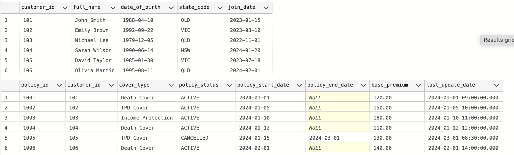
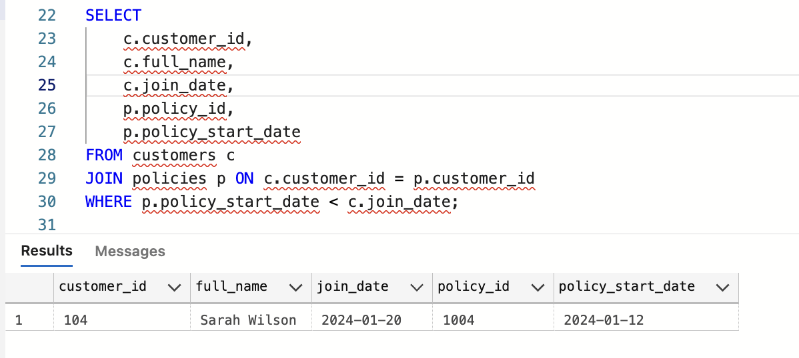
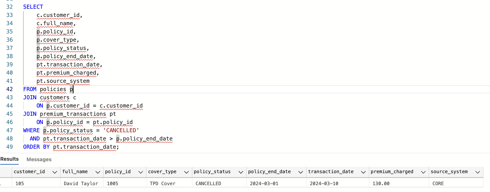

# Insurance Data Quality Analysis

SQL project analysing insurance policy and premium transaction data to identify data quality issues and control failures.

## Overview
This project focuses on validating data accuracy in an insurance environment rather than building dashboards or predictive models. 

It simulates real-world checks that would typically be performed by an Insurance Data Officer, including premium validation, data integrity checks, and control monitoring.

## Dataset
The project uses three core tables:
- **customers** – customer information and join dates  
- **policies** – policy details including start date and base premium  
- **premium_transactions** – actual premium charges and source systems  

## Sample Results

### Premium Validation

This analysis compares expected premium (base premium) with actual charged amounts and identifies:
- Missing charges  
- Overcharged transactions  
- Undercharged transactions  

---

### Date Integrity Issue

This check identifies cases where a policy start date occurs before the customer join date, indicating a data integrity issue.

---

### Post-Cancellation Transactions

This analysis detects transactions processed after a policy has been cancelled, highlighting a control failure and potential compliance risk.

## Tools
- SQL Server  
- Azure Data Studio  

## Purpose
This project demonstrates how SQL can be used to perform data validation, detect anomalies, and identify business risks in insurance data.
